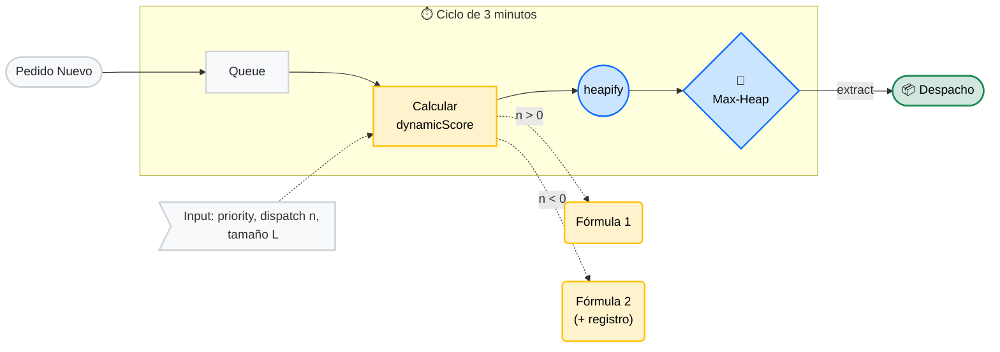

# VelozMart: Optimización de órdenes

> [!WARNING]
> Este texto es una transcripción del documento [velozMart.pdf](https://github.com/rifusaki/velozMart/blob/825109fdc6dd9d16c021674f2182f2d5a945c442/docs/VelozMart.pdf) agregado en el commit [825109f](https://github.com/rifusaki/velozMart/commit/825109fdc6dd9d16c021674f2182f2d5a945c442) a las 23:59.

## 1. Presentación del problema

El objetivo de este documento es presentar un algoritmo de priorización de pedidos de una tienda online basándose en los siguientes factores:

1. **priorityScore**: Calculado anteriormente con factores externos. `int: [0, 100]`.
2. **dispatchWindow**: Tiempo restante para el vencimiento. `int: (-inf, 0) ∪ (0, inf]`.
3. **sizeCategory**: Tamaño del pedido. `dict: {P: int, M: int, G: int}`

## 2. Algoritmo: DynaHeap

Este algoritmo está motivado por una serie de suposiciones operativas:

- No conocemos límites de espacio o tiempos de despacho
- Contamos con tres variables de distinto tipo que definen la prioridad del envío
- El único dato final que se necesita es la siguiente orden para despachar
- Los pedidos pequeños son más comunes y fáciles de enviar

Dado que sólo necesitamos leer un dato a la vez, se eligió un Max Heap como método de cola de prioridad principal, y el valor en el que se basa es un puntaje combinado dinámico calculado del siguiente modo:

$$
\text{score} =
\begin{cases}
W_1 \cdot \text{priorityScore} + W_2 \cdot \dfrac{1}{\text{dispatchWindow}} + \text{sizeBonus} & \text{si } \text{dispatchWindow} > 0 \\[10pt]
W_1 \cdot \text{priorityScore} + \text{sizeBonus} + W_3 \cdot (-\text{dispatchWindow}) & \text{si } \text{dispatchWindow} < 0
\end{cases}
$$

Teniendo $W_n$ pesos calculados dinámicamente, como se presentará más adelante. Contamos con tres tipos de variables, y el modo en el que se manejan depende de su naturaleza:

- **priorityScore** se multiplica por un número real: es proporcional al puntaje combinado. Responde a la prioridad del negocio.
- **dispatchWindow**, al ser inversamente proporcional (menos tiempo representa más urgencia; pedidos vencidos aún más), cuenta con dos casos:
  - *Pedido a tiempo* (`> 0`): $W_2$ se multiplica por el inverso de `dispatchWindow`. La naturaleza de $\frac{1}{x}$ hará que se prioricen agresivamente los valores pequeños.
  - *Pedido retrasado* (`< 0`): $W_3$ se multiplica por el negativo de `dispatchWindow`. Un valor grande disparará linealmente la urgencia.
- **sizeBonus** nace de la naturaleza categórica del tamaño del pedido: se priorizan los pedidos más pequeños (asumimos que son más fáciles de enviar) con un bono. Evita que se acumulen muchos pedidos pequeños—más comunes.

Este puntaje, al depender del tiempo, se calcula cada 3 minutos (elegido arbitrariamente). Al momento de ingresar un nuevo pedido este entra a una lista de espera, y el cálculo del puntaje se hace simultáneamente con nuevos y viejos pedidos pendientes.

Presentamos un pseudocódigo básico de implementación:

```
FUNCTION CalculateScore(order):
    IF order.dispatchWindow > 0:
        RETURN (W1 * order.priorityScore) + (W2 * order.dispatchWindow) + order.sizeBonus
    ELSE:
        RETURN (W1 * order.priorityScore) + order.sizeBonus + (W3 * ABS(order.dispatchWindow))
    LogExpired(order.id, CurrentTime())

FUNCTION ProcessThreeMinuteUpdate():
    Move NewOrdersBuffer TO MainList
    FOR EACH order IN MainList:
        order.dispatchWindow -= 3
        IF order.dispatchWindow == 0:
            order.dispatchWindow = -1
        order.score = CalculateScore(order)
    MainHeap = Heapify(MainList)

FUNCTION DispatchNextOrder():
    IF MainHeap IS NOT EMPTY:
        bestOrder = MainHeap.ExtractMax()
        DeliverPackage(bestOrder)
        LogDispatched(order.id, CurrentTime)
```

Es importante mencionar la consideración de **condiciones de carrera**: en una implementación real es necesario tener siempre un Heap disponible, y actualizar en segundo plano. Adicionalmente, tenemos las siguientes métricas de rendimiento para optimizar:

- **Pedidos vencidos**: `dispatchWindow < 0`
- **Tiempo de atraso**: `dispatchTime - expiredTime`
- **Throughput**: `dispatchTime`
- **Tiempo promedio de despacho**: `dispatchTime - insertionTime`

El despacho, en tiempo, cuesta $O(\log n)$ y la inserción—heapify— $O(n)$. La inserción se hace en lotes cada 3 minutos y el cálculo del puntaje es de tiempo constante. Es eficiente mientras sólo sea necesario extraer la raíz del árbol.

## 3. Diagrama



Un diagrama más detallado se puede encontrar en [este enlace [click].](https://lucid.app/lucidchart/e888fd80-a55a-4379-9ab8-dc91d18a6bc2/edit?viewport_loc=2733%2C500%2C4622%2C2372%2C0_0&invitationId=inv_eeb28022-2511-4e59-91a5-ea6adf2ab59a)

## 4. Mapa de tradeoffs

| | TRADE-OFF |
|---|---|
| **PRO** | |
| EXTRACCIÓN RÁPIDA | Max-Heap da $O(\log N)$ al extraer. El trabajador nunca espera. |
| FLEXIBILIDAD DEL NEGOCIO | Cambiar pesos ($W_1$, $W_2$, $W_3$) ajusta la estrategia sin rehacer el sistema. |
| EFICIENCIA POR BATCHING | Recalcular cada 3 min con heapify $O(N)$ mantiene CPU baja. |
| **CONTRA** | |
| VISIBILIDAD PARCIAL | El heap solo da el top 1. Ver los próximos 50 pedidos es costoso. |
| SENSIBILIDAD EXTREMA A PARÁMETROS MATEMÁTICOS | Un error en pesos ($W_2$) puede hacer que VIPs sean ignorados. |
| RIESGO RESIDUAL DE INANICIÓN | Pedidos grandes y de baja prioridad pueden quedar atrapados si llegan muchos pequeños urgentes. |

## 5. Próximos pasos: Implementación, aprendizaje automático, pruebas A/B

El modelo, hasta este punto, se encuentra en su estado más generalizado: sus pesos—que definen el orden final—no se encuentran definidos. Sin embargo, esta es una ventaja: es posible desarrollar un método de optimización. En el repositorio en el cual se encuentra el presente documento se llevó a cabo la optimización con los siguientes parámetros. Esta implementación de búsqueda en cuadrícula fue programada por Deepseek bajo nuestros parámetros. Los resultados se pueden encontrar en [este enlace [clic].](https://github.com/rifusaki/velozMart/blob/main/src/model.ipynb)
